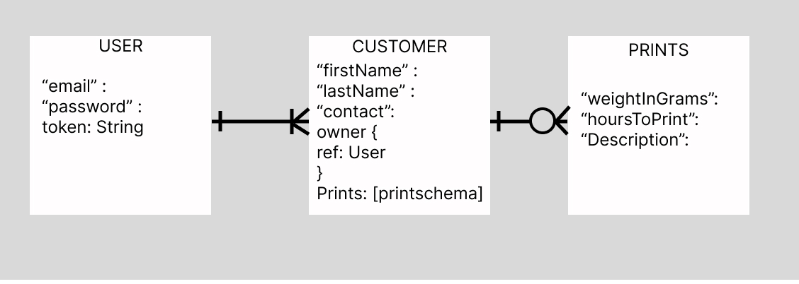

# Jobbr3D 
A 3D printing print tracking app for freelancers to keep their jobs organized. It will allow them to keep track of the jobs, customers, and eventually track their materials. Down the road, I want it to be able to help them with tracking their profits and expenses. I also want to intergrate it with octoprint, so they can manage their printers remotely within the app. This would allow esentially have all the most important aspects of there business in one place. //revise this later. 

## MVP
As a user...
    - I want to create a new customer because I want to store potential leads.  
    - I want to want to update a customer because they want to change their contact information. 
    - I want to see a list of all my customers in case I need to contact them and I don't have there contact information on hand. 
    - I want to delete a customer because I want to remove customers that may only do business with me once for a small job.  

    - I want to add new print for my customers because if I have a returning customer, I want to be able to add a new job. 
    - I want to see the prints that my customers currently have outstanding
    - I want to update a print because protoyping is a process, and details about the print may change often. 
    - I want to remove a print because a customer might change their mind and I want to reflect that.

    - I want to sign-up
    - I want to sign-in
    - I want my own unique database.
    - I want to see my unfinished jobs because I want to see what I have left to do. 
    - I want to see my finished jobs because I might have done the exact same print for another customer before. 
## Version 2
    - I want to add in my materials for tracking 
    - When a job completes, I want the material that was used in the print to update so I can see the amount remaining 
    - I want to store information about a previously agreeded on price because I want to be able to reference it if something comes up.  
    - I want seperate catergory for when I design things, as opposed to when I just print things because I want to charge for my time. 
    - Want a calaulator for determing how much I should charge for things like wear and tear on my machine, because there are consumables associated with a 3d printer that I have to buy. 
    - Want a calculator for determining how much I should markup my material costs because it is tricky to land on a price. 
## Version 3
    - I want to be able to access my octoprint instances within the app so I can essentially everything to do with my business within one app.
    - I want a tool that reccommends a price point for my services based on past jobs, and other users, because it can be tricky to know how much to charge. 

## Wireframe of USER Experience. 

[label](project-2-wireframe.jpg%EF%80%BAZone.Identifier)

## ERD
